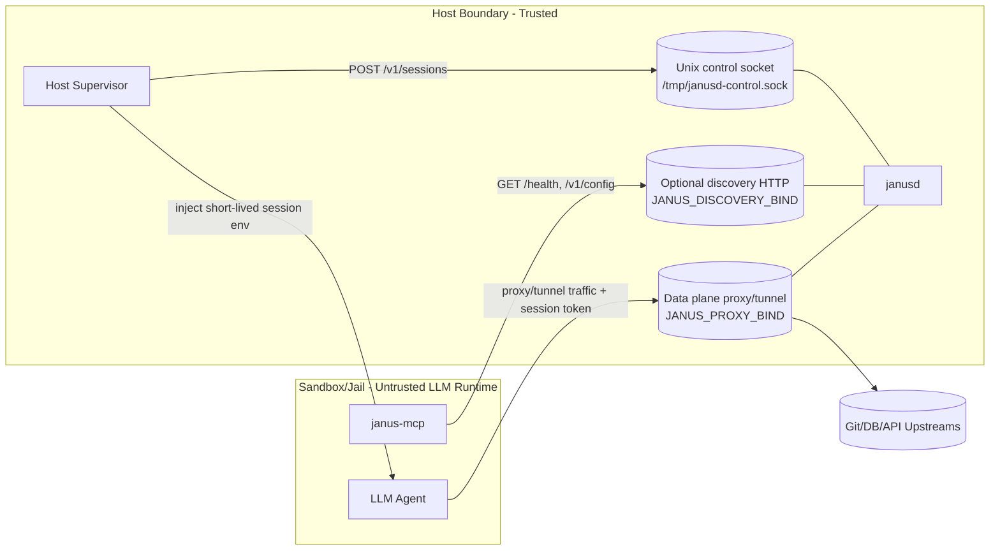

# Janus

Janus is a host-side secret broker for sandboxed LLM agents.

User goal: start Janus, connect MCP, and let the LLM operate through Janus safely.
You do not need to manually craft proxied data-plane calls in normal usage.

Published repository: `https://github.com/nzpr/janus`

## Quickstart (Sandboxed Agent)

Use this exact sequence first.

1. Start Janus on host:

```bash
cd /workspace
export JANUS_GIT_HTTP_PASSWORD=replace-me
export JANUS_DISCOVERY_BIND=127.0.0.1:9181
make start
make health
```

2. Start `janus-mcp` in the jailed agent runtime:

```bash
export JANUS_PUBLIC_BASE_URL=http://host.docker.internal:9181
janus-mcp
```

3. On host, issue a scoped session (manual example):

```bash
curl --unix-socket /tmp/janusd-control.sock \
  -s -X POST http://localhost/v1/sessions \
  -H 'content-type: application/json' \
  -d '{
    "ttl_seconds": 3600,
    "allowed_hosts": ["codeberg.org","api.cohere.ai"],
    "capabilities": ["http_proxy","git_http","git_ssh","postgres_wire","redis"]
  }'
```

4. Inject the returned `env` map into the jailed agent process/container.

5. Run the agent normally:
   - discovery/planning via MCP (`janus.discovery`),
   - actual network traffic via Janus data plane using session env.

Important:
- do not mount `/tmp/janusd-control.sock` into jail,
- keep control plane host-only; jail only gets discovery URL + session env.

## 1) Architecture

### Components

- `janusd` (host): deterministic policy broker and proxy/tunnel data plane.
- Host supervisor (host): trusted process that creates sessions and injects session env into jailed runtime.
- `janus-mcp` (usually inside jail with the LLM): read-only discovery bridge for planning.
- LLM agent (jail): uses session-scoped proxy/tunnel access.
- Upstream services: Git, PostgreSQL, Redis, HTTP APIs, etc.

### Architecture Chart



### Trust Boundaries

- Control socket stays on host and is not mounted into jail.
- MCP is read-only metadata (`/health`, `/v1/config`) and cannot create sessions.
- LLM traffic to upstreams is mediated by Janus data plane and session checks.

## 2) Why Session Tokens

Session tokens are not for “making the LLM trusted”.
They are for scoped delegation and blast-radius reduction.

- Short-lived: each token has TTL.
- Least privilege: each token is scoped by `capabilities` and `allowed_hosts`.
- Revocable: host can delete session or let it expire quickly.
- Secret isolation: upstream credentials remain host-side; jail gets only delegated token.

If a token is stolen, attacker impact is limited to that token scope/lifetime, not all host secrets.

## 3) Interfaces And Ports

| Plane | Interface | Default | Purpose | Expose to Jail? |
|---|---|---|---|---|
| Control | Unix socket | `/tmp/janusd-control.sock` | Session create/list/delete, typed adapters | No |
| Discovery | HTTP (optional) | disabled unless `JANUS_DISCOVERY_BIND` set | Read-only metadata for MCP (`/health`, `/v1/config`) | Yes (if MCP is jailed) |
| Data | TCP HTTP proxy/tunnel | `127.0.0.1:9080` | Actual proxied/tunneled protocol traffic | Yes |

## 4) Protocols Janus Can Proxy

Source of truth: `src/protocols/*.rs` and `src/protocols/mod.rs`.

| Capability | Protocol | Typical Target Ports | Transport Path |
|---|---|---|---|
| `http_proxy` | Generic HTTP/HTTPS | any URL | HTTP proxy env (`HTTP_PROXY`/`HTTPS_PROXY`) |
| `git_http` | Git over HTTPS | 443 | host-side Git HTTP route rewrite through Janus |
| `git_ssh` | Git over SSH | 22 | HTTP CONNECT tunnel |
| `postgres_wire` | PostgreSQL wire | 5432 | HTTP CONNECT tunnel |
| `mysql_wire` | MySQL wire | 3306 | HTTP CONNECT tunnel |
| `redis` | Redis | 6379 | HTTP CONNECT tunnel |
| `mongodb` | MongoDB | 27017 | HTTP CONNECT tunnel |
| `amqp` | AMQP | 5672 | HTTP CONNECT tunnel |
| `kafka` | Kafka | 9092 | HTTP CONNECT tunnel |
| `nats` | NATS | 4222 | HTTP CONNECT tunnel |
| `mqtt` | MQTT/MQTTS | 1883, 8883 | HTTP CONNECT tunnel |
| `ldap` | LDAP/LDAPS | 389, 636 | HTTP CONNECT tunnel |
| `sftp` | SFTP | 22 | HTTP CONNECT tunnel |
| `smb` | SMB/CIFS | 445 | HTTP CONNECT tunnel |

## 5) Deploy And Use (Exact Recipes)

### Recipe A: Host Process + Jailed MCP (recommended first)

1. Prepare host env:

```bash
cp .env.example .env
export JANUS_GIT_HTTP_PASSWORD=replace-me
export JANUS_DISCOVERY_BIND=127.0.0.1:9181
```

2. Start Janus on host:

```bash
make start
```

3. Verify host daemon:

```bash
make health
```

Expected: JSON containing `"status":"ok"`.

4. Configure MCP in jailed runtime:

```bash
export JANUS_PUBLIC_BASE_URL=http://host.docker.internal:9181
# optional:
# export JANUS_PUBLIC_AUTH_BEARER=...
janus-mcp
```

5. Host supervisor responsibilities:
   - call control socket `POST /v1/sessions`,
   - inject returned scoped env into jailed agent process,
   - rotate/revoke sessions by TTL or delete.

6. LLM responsibilities:
   - use MCP discovery tools/resources to understand availability,
   - perform normal tool/protocol actions; data traffic goes through Janus.

### Recipe B: Docker Deploy + Jailed MCP

1. Prepare env file:

```bash
cp .env.docker.example .env
```

2. Deploy:

```bash
PROXY_PORT=9080 DISCOVERY_PORT=9181 make deploy
```

3. Verify:

```bash
make logs
make health
```

4. Stop:

```bash
make stop
```

## 6) MCP Configuration Example

```json
{
  "mcpServers": {
    "janus": {
      "command": "janus-mcp",
      "args": [],
      "env": {
        "JANUS_PUBLIC_BASE_URL": "http://host.docker.internal:9181"
      }
    }
  }
}
```

If running from source:

```json
{
  "mcpServers": {
    "janus": {
      "command": "cargo",
      "args": ["run", "--quiet", "--bin", "janus-mcp", "--"],
      "cwd": "/workspace",
      "env": {
        "JANUS_PUBLIC_BASE_URL": "http://host.docker.internal:9181"
      }
    }
  }
}
```

## 7) Environment Variables

Core Janus:

- `JANUS_PROXY_BIND` (default `127.0.0.1:9080`)
- `JANUS_CONTROL_SOCKET` (default `/tmp/janusd-control.sock`)
- `JANUS_DISCOVERY_BIND` (optional; example `127.0.0.1:9181`)
- `JANUS_DEFAULT_TTL_SECONDS` (default `3600`)
- `JANUS_DEFAULT_CAPABILITIES` (default `http_proxy,git_http`)
- `JANUS_ALLOWED_HOSTS` (default `github.com,api.github.com,gitlab.com`)

MCP transport:

- `JANUS_PUBLIC_BASE_URL` (when set, `janus-mcp` uses HTTP(S) discovery)
- `JANUS_PUBLIC_AUTH_BEARER` (optional bearer token for discovery endpoint)
- `JANUS_CONTROL_SOCKET` (used by `janus-mcp` only if `JANUS_PUBLIC_BASE_URL` is unset)

Git:

- `JANUS_GIT_HTTP_PASSWORD` or `JANUS_GIT_HTTP_TOKEN`
- `JANUS_GIT_HTTP_USERNAME` (default `x-access-token`)
- `JANUS_GIT_HTTP_HOSTS` (default `github.com`)
- `JANUS_GIT_SSH_AUTH_SOCK` (default `/var/run/janus/ssh-agent.sock`)
- `JANUS_GIT_SSH_PRIVATE_KEY_FILE` (optional)
- `JANUS_GIT_SSH_PRIVATE_KEY_B64` (optional)
- `JANUS_GIT_SSH_PRIVATE_KEY` (optional)

Optional tooling:

- `JANUS_KUBECONFIG`
- `JANUS_NO_BANNER=1`

## License And Warranty

Licensed under MIT. See [LICENSE](./LICENSE).

This software is provided **"AS IS"**, without warranty of any kind, express or implied.
