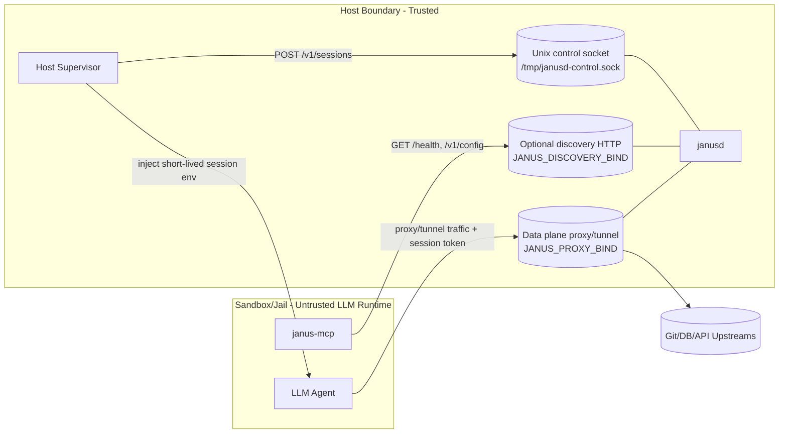

# Janus

Janus is a host-side secret broker for sandboxed LLM agents.

User goal: start Janus, connect MCP, and let the LLM operate through Janus safely.
You do not need to manually craft proxied data-plane calls in normal usage.

Published repository: `https://github.com/nzpr/janus`

## 1) Architecture

### Components

- `janusd` (host): deterministic policy broker and proxy/tunnel data plane.
- Host supervisor (host): trusted process that creates sessions and injects session env into jailed runtime.
- `janus-mcp` (usually inside jail with the LLM): read-only discovery bridge for planning.
- LLM agent (jail): uses session-scoped proxy/tunnel access.
- Upstream services: Git, PostgreSQL, Redis, HTTP APIs, etc.

### Architecture Chart



### Trust Boundaries

- Control socket stays on host and is not mounted into jail.
- MCP is read-only metadata (`/health`, `/v1/config`) and cannot create sessions.
- LLM traffic to upstreams is mediated by Janus data plane and session checks.

## 2) Why Session Tokens

Session tokens are not for “making the LLM trusted”.
They are for scoped delegation and blast-radius reduction.

- Short-lived: each token has TTL.
- Least privilege: each token is scoped by `capabilities` and `allowed_hosts`.
- Revocable: host can delete session or let it expire quickly.
- Secret isolation: upstream credentials remain host-side; jail gets only delegated token.

If a token is stolen, attacker impact is limited to that token scope/lifetime, not all host secrets.

## 3) Interfaces And Ports

| Plane | Interface | Default | Purpose | Expose to Jail? |
|---|---|---|---|---|
| Control | Unix socket | `/tmp/janusd-control.sock` | Session create/list/delete, typed adapters | No |
| Discovery | HTTP (optional) | disabled unless `JANUS_DISCOVERY_BIND` set | Read-only metadata for MCP (`/health`, `/v1/config`) | Yes (if MCP is jailed) |
| Data | TCP HTTP proxy/tunnel | `127.0.0.1:9080` | Actual proxied/tunneled protocol traffic | Yes |

## 4) Exact Usage (Recommended: LLM Always Jailed)

### Step 0: Prepare host env

Create `.env` (or export vars):

```bash
cp .env.example .env
# required for git over HTTPS if used:
export JANUS_GIT_HTTP_PASSWORD=replace-me
# enable read-only discovery for jailed MCP:
export JANUS_DISCOVERY_BIND=127.0.0.1:9181
```

### Step 1: Start `janusd` on host

```bash
make start
```

Check host health (control plane socket):

```bash
make health
```

Expected: JSON with `"status":"ok"`.

### Step 2: Configure MCP in jailed runtime

In jail/container where LLM runs, point MCP to host discovery endpoint:

```bash
export JANUS_PUBLIC_BASE_URL=http://host.docker.internal:9181
# optional bearer auth if you add auth in front of discovery endpoint:
# export JANUS_PUBLIC_AUTH_BEARER=...
janus-mcp
```

MCP only reads:
- `GET /health`
- `GET /v1/config`

It cannot issue sessions and does not receive host secrets.

### Step 3: Let host supervisor issue a session and inject env to jail

Operationally required flow:

1. Host supervisor calls Janus control socket `POST /v1/sessions`.
2. Janus returns scoped env (`HTTP_PROXY`, `HTTPS_PROXY`, etc., based on capabilities).
3. Supervisor injects env into jailed agent process.
4. Agent/LLM runs with delegated short-lived access.

Note: this is host automation responsibility; end users typically do not do it manually.

### Step 4: LLM uses tools/protocols

- LLM discovers available protocols/resources via MCP (`janus.discovery`, resources).
- LLM traffic goes through Janus data plane with session token enforcement.

## 5) Docker Deployment Runbook

### Build and deploy

```bash
cp .env.docker.example .env
# expose data plane + discovery for jailed MCP:
PROXY_PORT=9080 DISCOVERY_PORT=9181 make deploy
```

### Verify

```bash
make logs
make health
```

### Stop

```bash
make stop
```

## 6) MCP Configuration Example

```json
{
  "mcpServers": {
    "janus": {
      "command": "janus-mcp",
      "args": [],
      "env": {
        "JANUS_PUBLIC_BASE_URL": "http://host.docker.internal:9181"
      }
    }
  }
}
```

If running from source:

```json
{
  "mcpServers": {
    "janus": {
      "command": "cargo",
      "args": ["run", "--quiet", "--bin", "janus-mcp", "--"],
      "cwd": "/workspace",
      "env": {
        "JANUS_PUBLIC_BASE_URL": "http://host.docker.internal:9181"
      }
    }
  }
}
```

## 7) Environment Variables

Core Janus:

- `JANUS_PROXY_BIND` (default `127.0.0.1:9080`)
- `JANUS_CONTROL_SOCKET` (default `/tmp/janusd-control.sock`)
- `JANUS_DISCOVERY_BIND` (optional; example `127.0.0.1:9181`)
- `JANUS_DEFAULT_TTL_SECONDS` (default `3600`)
- `JANUS_DEFAULT_CAPABILITIES` (default `http_proxy,git_http`)
- `JANUS_ALLOWED_HOSTS` (default `github.com,api.github.com,gitlab.com`)

MCP transport:

- `JANUS_PUBLIC_BASE_URL` (when set, `janus-mcp` uses HTTP(S) discovery)
- `JANUS_PUBLIC_AUTH_BEARER` (optional bearer token for discovery endpoint)
- `JANUS_CONTROL_SOCKET` (used by `janus-mcp` only if `JANUS_PUBLIC_BASE_URL` is unset)

Git:

- `JANUS_GIT_HTTP_PASSWORD` or `JANUS_GIT_HTTP_TOKEN`
- `JANUS_GIT_HTTP_USERNAME` (default `x-access-token`)
- `JANUS_GIT_HTTP_HOSTS` (default `github.com`)
- `JANUS_GIT_SSH_AUTH_SOCK` (default `/var/run/janus/ssh-agent.sock`)
- `JANUS_GIT_SSH_PRIVATE_KEY_FILE` (optional)
- `JANUS_GIT_SSH_PRIVATE_KEY_B64` (optional)
- `JANUS_GIT_SSH_PRIVATE_KEY` (optional)

Optional tooling:

- `JANUS_KUBECONFIG`
- `JANUS_NO_BANNER=1`

## License And Warranty

Licensed under MIT. See [LICENSE](./LICENSE).

This software is provided **"AS IS"**, without warranty of any kind, express or implied.
